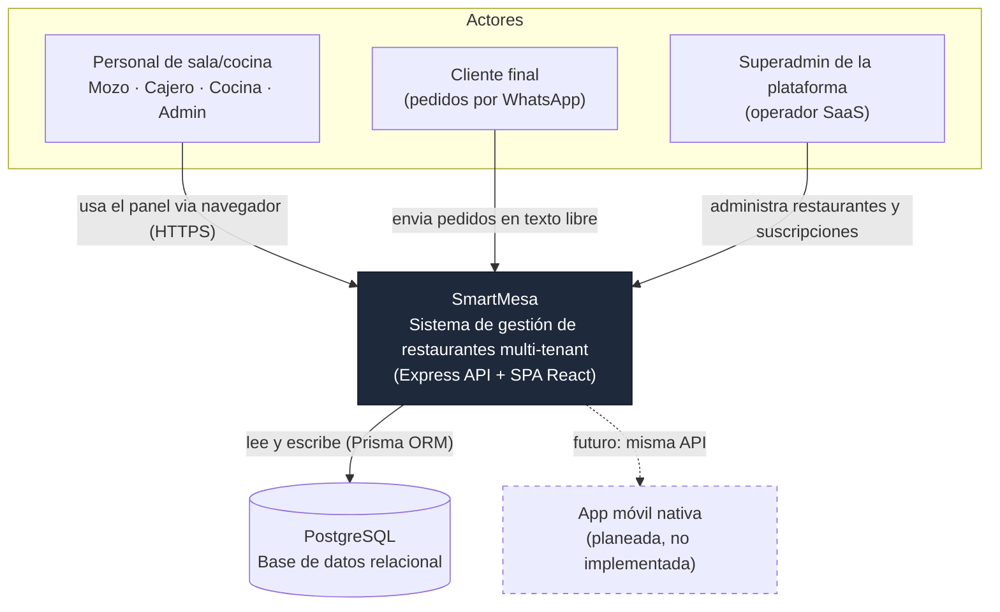

# 01 — Contexto del sistema (C4 Nivel 1)

SmartMesa es un sistema de gestión de restaurantes **multi-tenant**: una misma
instalación atiende a varios restaurantes (`Restaurant`), cada uno con sus propias
sucursales (`Branch`), aislados entre sí a nivel de datos.

## Diagrama

## Actores

| Actor | Quién es | Cómo entra al sistema |
|---|---|---|
| Mozo | Toma pedidos en salón | SPA React, rol `MOZO` |
| Cajero | Cobra pedidos, cierra mesas | SPA React, rol `CAJA` |
| Cocina | Ve y avanza el estado de los ítems a preparar | SPA React, rol `COCINA` (vista forzada a `/kitchen`) |
| Admin / Supervisor | Gestiona productos, mesas, usuarios, reportes | SPA React, roles `ADMIN` / `SUPERVISOR` |
| Cliente final | Pide comida por WhatsApp | Mensaje de texto libre, sin login — lo resuelve el módulo WhatsApp del backend |
| Superadmin SaaS | Da de alta restaurantes, gestiona suscripciones | Mismo login, `isSuperAdmin: true` — ve un panel distinto (SaaS Panel) en vez del panel operativo |

## Sistemas externos

- **PostgreSQL**: única base de datos, accedida exclusivamente vía Prisma ORM desde la API.
- **App móvil**: no existe todavía. Se representa punteada porque el diseño (API REST +
  JWT) ya la habilita sin cambios de arquitectura, pero no hay código de cliente móvil
  en este repositorio.

## Qué no se ve en este nivel

Este diagrama no distingue frontend de backend ni describe protocolos — eso es el
[nivel 2 (contenedores)](./02-contenedores.md).
