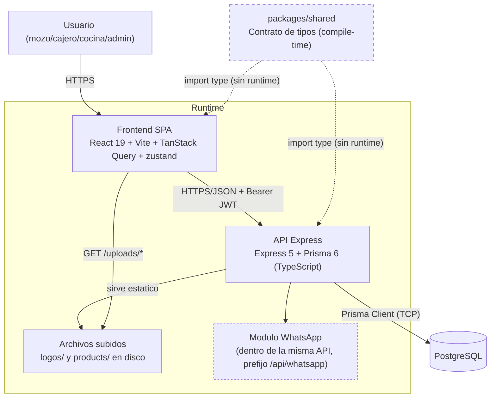

# 02 — Contenedores (C4 Nivel 2)

Las piezas desplegables del sistema y cómo se hablan entre sí.

## Diagrama

## Contenedores

| Contenedor | Tecnología | Responsabilidad |
|---|---|---|
| Frontend SPA | React 19, Vite 8, Tailwind 4, TanStack Query, zustand, react-router v7 | UI de las 11 áreas funcionales (auth, dashboard, pos, tables, kitchen, cashier, inventory, customers, reports, settings, saas). Cachea el estado del servidor con React Query; persiste sesión con zustand. |
| API Express | Express 5, Prisma 6, PostgreSQL, TypeScript estricto | Capa `routes → controllers → services`. Autenticación JWT + autorización por rol. Único punto de acceso a la base de datos. |
| Módulo WhatsApp | Parser + servicio dentro de la misma API | Convierte mensajes de texto libre en pedidos de delivery. Único grupo de rutas montado bajo `/api/whatsapp`; el resto de la API no usa prefijo `/api`. |
| Archivos subidos | `multer` + `express.static` | Logos de negocio y fotos de producto, servidos desde `/uploads` en disco local (no hay object storage externo). |
| PostgreSQL | PostgreSQL (vía Prisma) | Única fuente de verdad. ~30 modelos; ver [modelo de datos](./03-modelo-datos.md). |
| `packages/shared` | TypeScript, cero dependencias | **No es un contenedor en runtime.** Es el contrato de tipos (`import type` únicamente) que describe exactamente lo que viaja por HTTP entre frontend y backend. Se borra al compilar — de ahí la línea punteada. |

## Detalles que importan

- **Sin prefijo `/api` uniforme**: casi todas las rutas del backend cuelgan directo de
  la raíz (`POST /orders`, `POST /auth/login`, `GET /kitchen/orders`...). La única
  excepción es el módulo WhatsApp, montado explícitamente en `/api/whatsapp`.
- **Autenticación stateless**: cada request autenticado lleva `Authorization: Bearer
  <JWT>`. El middleware `authMiddleware` valida la firma y expone `req.user`; no hay
  sesión en el servidor ni en la base de datos.
- **`packages/shared` como guardia de contrato**: el backend usa `assertWire<T>()`
  (`apps/backend/src/utils/wire.ts`) para forzar en tiempo de compilación que lo que
  Prisma devuelve siga coincidiendo con el tipo publicado — hoy aplicado en `auth`,
  `products`, `orders`, `tables` y `saas`. Si un `include` de Prisma cambia y deja de
  matchear el tipo, `tsc` falla antes de llegar a producción.
- **Frontend apunta a la API vía `VITE_API_URL`**: si la variable no está definida, cae
  en un valor por defecto hardcodeado en `apps/frontend/src/lib/api.ts` (una IP fija),
  no en `localhost` — vale la pena definirla siempre en desarrollo.
