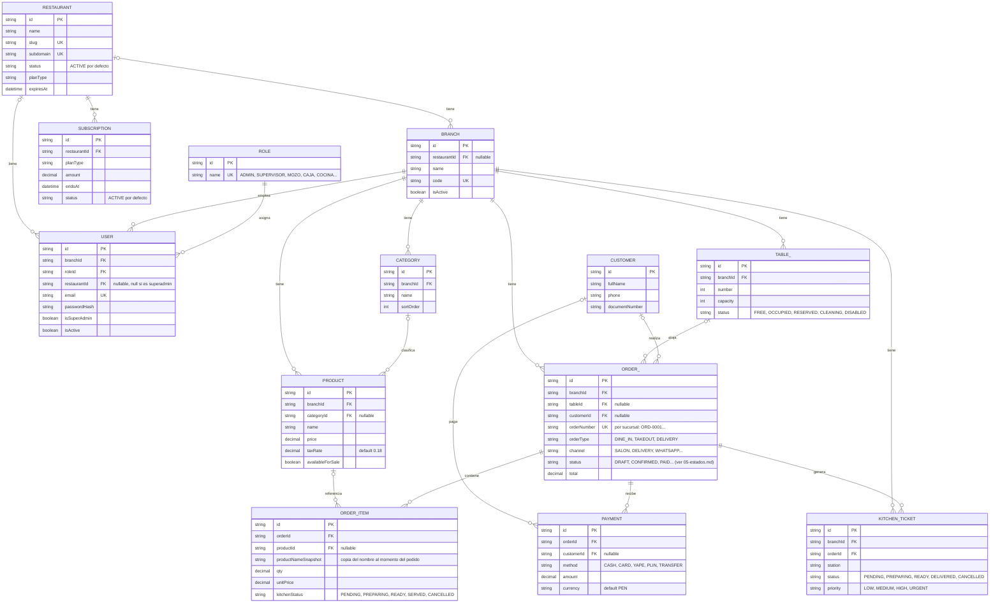

# 03 — Modelo de datos

`apps/backend/prisma/schema.prisma` define ~30 modelos. Este documento cubre el
**dominio core** (13 entidades con API expuesta y uso real) y deja registro del resto
como roadmap del dominio.

## Dominio core

> `TABLE_` y `ORDER_` llevan guión bajo porque `TABLE` y `ORDER` son palabras
> reservadas en SQL/Mermaid; en el schema real los modelos se llaman `Table` y `Order`.

## Nota sobre `KitchenTicket`

`KitchenTicket` está en el dominio core del schema (tiene estación, prioridad y
estado propio), pero **ningún endpoint del backend lo crea ni lo consulta hoy**: la
vista de cocina (`GET /kitchen/orders`) arma su respuesta directamente desde
`Order` + `OrderItem.kitchenStatus`, sin tocar esta tabla. Está modelada pero inerte.

## Roadmap del dominio

Modelos presentes en `schema.prisma` sin ninguna ruta ni controlador que los exponga
(`apps/backend/src/routes` no tiene archivo para ninguno de estos):

| Modelo | Para qué serviría | Estado |
|---|---|---|
| `Reservation` | Reservas de mesa por cliente | Modelado, sin API |
| `DiningArea` | Agrupar mesas en zonas (terraza, salón...) | Modelado, sin API — sí referenciado por `Table.diningAreaId` |
| `Modifier` / `ModifierOption` / `ProductModifier` | Variantes de producto (extras, tamaños) | Modelado, sin API |
| `CashRegister` / `CashSession` / `CashMovement` | Apertura/cierre de caja, arqueo | Modelado, sin API |
| `InventoryItem` / `InventoryMovement` / `Recipe` | Control de stock e insumos por receta | Modelado, sin API |
| `Supplier` / `Purchase` / `PurchaseItem` | Compras a proveedores | Modelado, sin API |
| `AuditLog` | Trazabilidad de cambios por usuario | Modelado, sin API |
| `Permission` / `RolePermission` | Permisos finos por rol | Modelado, sin API — ver limitación de autorización en el README raíz |
| `BusinessSetting` | Datos del negocio (nombre, RUC, logo) | **Sí tiene API** (`business-settings.routes.ts`) — no forma parte del dominio core transaccional pero está activo |
