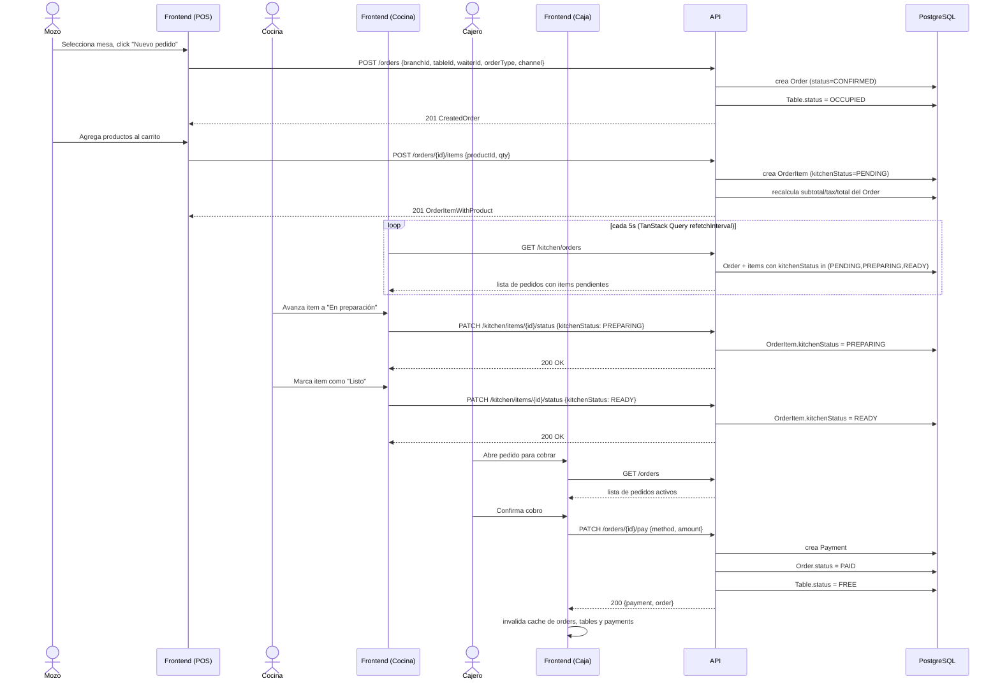
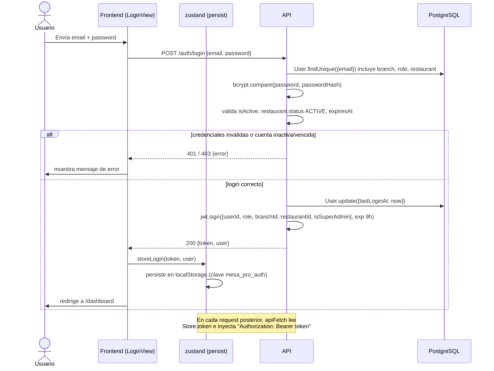
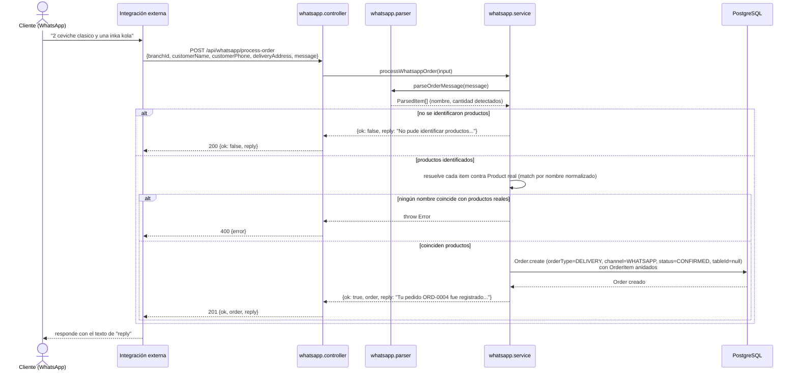

# 04 — Flujos principales

Tres flujos de punta a punta, con los endpoints reales tal como están definidos en
`apps/backend/src/routes` y consumidos desde `apps/frontend/src/features/*/hooks.ts`.

## 1. Ciclo de pedido completo (POS → cocina → caja)

Mozo crea el pedido, cocina lo prepara viendo la pantalla actualizarse sola (polling,
no websockets), y el cajero lo cobra — lo que libera la mesa automáticamente.

Notas:
- El "tiempo real" de cocina es **polling cada 5 segundos**, no WebSockets/SSE.
- Cobrar un pedido (`PATCH /orders/{id}/pay`) y eliminarlo (`DELETE /orders/{id}`) son
  los únicos dos caminos que liberan la mesa automáticamente.

## 2. Login y autenticación

Notas:
- El token expira a las 9 horas; no hay refresh token — al expirar, cualquier request
  autenticado devuelve 401 y el usuario debe loguearse de nuevo.
- Si `user.isSuperAdmin` es `true`, el layout (`App.tsx`) renderiza directamente el
  panel SaaS en vez del panel operativo, con el mismo token.

## 3. Pedido por WhatsApp

El mensaje llega ya como texto a un endpoint HTTP — este repositorio no incluye la
integración con la API de WhatsApp en sí, solo el parser y la creación del pedido.

Notas:
- El pedido de WhatsApp nunca pasa por cocina vía polling automático de la misma forma
  que un pedido de salón: entra directo con `status=CONFIRMED`, así que ya aparece en
  `GET /kitchen/orders` en el siguiente ciclo de polling — el flujo converge con el
  ciclo de pedido normal a partir de ahí.
- Existe también `POST /api/whatsapp/test-message`, que corre el parser sin crear
  ningún pedido (`simulateWhatsappOrder`) — útil para probar el reconocimiento de texto
  de forma aislada.
