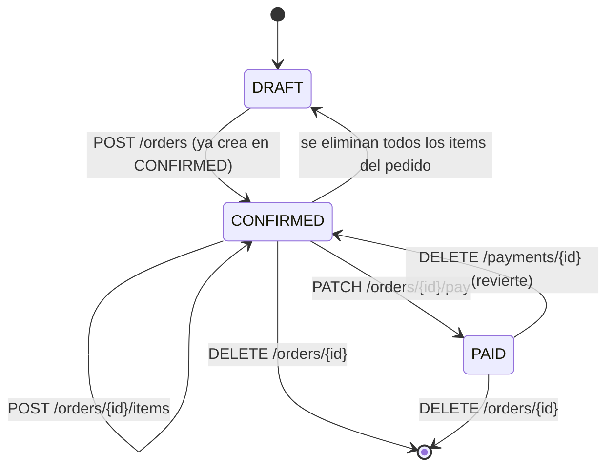
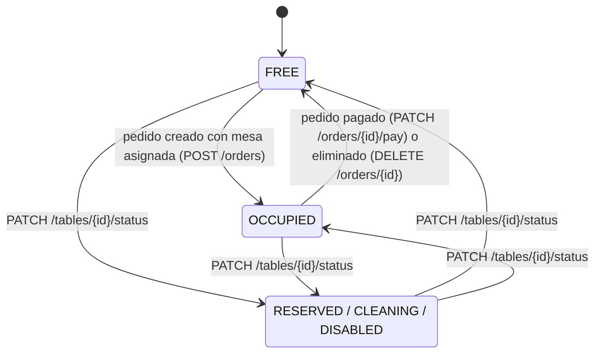
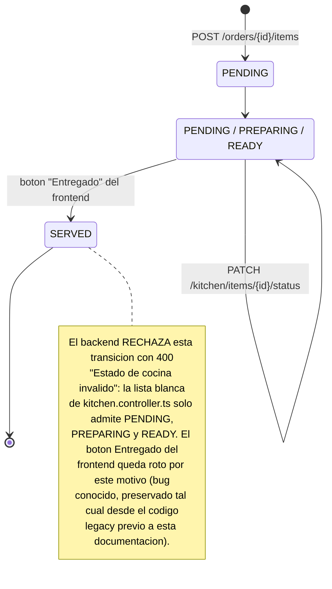

# 05 — Máquinas de estado

Tres estados relevantes del dominio. En los tres casos se documenta también la
diferencia entre **lo que el enum de Prisma permite** y **lo que el backend realmente
ejecuta** — es la parte más honesta (y más útil) de este documento.

## Estado del pedido (`Order.status`)

`schema.prisma` define 8 valores para `OrderStatus`, pero el código de
`apps/backend/src/services/orders.service.ts` y `payments.service.ts` solo produce
tres de ellos.

> **No alcanzables por código:** `IN_KITCHEN`, `READY`, `SERVED`, `BILLED`,
> `CANCELLED` existen en el enum `OrderStatus` de `schema.prisma` pero ningún
> endpoint del backend los asigna hoy. El progreso de cocina se rastrea a nivel de
> **ítem** (`OrderItem.kitchenStatus`, ver más abajo), no a nivel de pedido — por eso
> el pedido nunca pasa por `IN_KITCHEN` ni `READY` como tal.

## Estado de la mesa (`Table.status`)

> **Sin validación de transición:** `PATCH /tables/{id}/status` (en
> `tables.controller.ts`) solo valida que el valor enviado pertenezca a la lista
> `[FREE, OCCUPIED, RESERVED, CLEANING, DISABLED]` — no valida el estado *actual* de
> la mesa. Cualquier estado puede pasar a cualquier otro manualmente; el diagrama
> agrupa `RESERVED/CLEANING/DISABLED` porque, en el código, son intercambiables entre
> sí y con `FREE`/`OCCUPIED` sin ninguna regla adicional.

## Estado del ítem en cocina (`OrderItem.kitchenStatus`)

> **`CANCELLED`** también existe en el enum `KitchenItemStatus` pero, igual que
> `SERVED`, no está en la lista blanca de `updateKitchenItemStatus` — no hay forma de
> cancelar un ítem individual desde la API actual.

## Por qué esto importa para el portfolio

Documentar las transiciones *no alcanzables* no es un defecto de la documentación —
es la diferencia entre un diagrama que describe el `schema.prisma` (lo que se podría
construir) y uno que describe el sistema real (lo que efectivamente corre). Ver
["Limitaciones conocidas"](../../README.md#limitaciones-conocidas) en el README raíz
para el resto de los gaps documentados del mismo modo.
